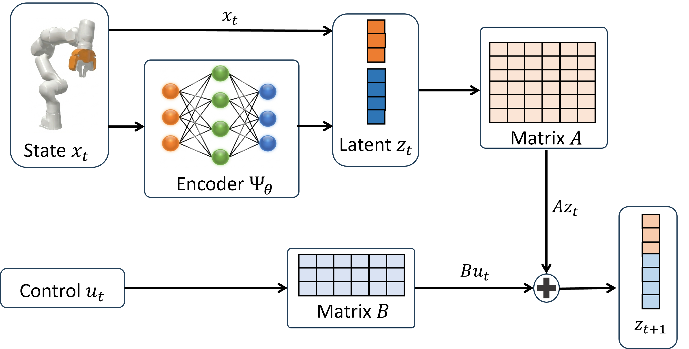
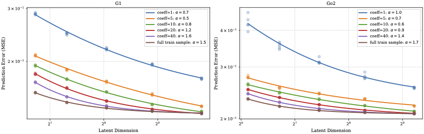

# Scaling Law of Neural Koopman Operators

Abulikemu Abuduweili, Yuyang Pang, Feihan Li, Changliu Liu, [Scaling Law of Neural Koopman Operators](https://arxiv.org/abs/2602.19943),
*arXiv preprint*, 2026

## Introduction

Koopman operator theory lifts nonlinear dynamics $x_{t+1} = f(x_t, u_t)$ into a higher-dimensional space where the evolution is linear: a learned encoder $\varphi: \mathbb{R}^d \to \mathbb{R}^n$ maps the state to $z = \varphi(x)$ so that $z_{t+1} = Az_t + Bu_t$, enabling classical linear control (LQR, MPC) on complex nonlinear systems. **How do prediction and control errors scale with the latent dimension $n$ and the number of training samples $m$?** We study this across 8 nonlinear systems — pendulums, robot arms, humanoids, and quadrupeds — and establish a scaling law governing the data-model tradeoff.


<p align="center">
  
</p>

## Scaling Law (Corollary 1)

We prove that the prediction error of a neural Koopman model with latent dimension $n$ trained on $m$ samples is bounded by:

$$
\epsilon(n, m) = \mathcal{O}\left(\sqrt{\frac{\ln n}{m}}\right) + \mathcal{O}\left(\frac{1}{n^{\alpha - 1/2}}\right)
$$


- **First term — statistical error**: decreases as the number of training samples $m$ grows. More data yields better generalization.
- **Second term — approximation error**: decreases as the latent dimension $n$ increases. A larger latent space captures more of the true Koopman spectrum.

The two terms reveal a **data-model tradeoff**: increasing $n$ reduces approximation error but inflates statistical error unless $m$ grows accordingly. Balancing the two terms gives the optimal scaling:

$$
m = c \cdot n \cdot \ln(n)
$$

where $c$ is an environment-dependent constant. This predicts the minimum data needed for a given model size to achieve near-optimal error, and is validated empirically across all 8 environments.

<p align="center">
  
</p>

## Training Losses

- **Multi-step prediction loss**: reconstruction error over $K$ future steps with discounted weighting.
- **Inverse control loss**: reconstructs $u_t$ from consecutive latent states via the pseudo-inverse of $B$, preserving controllability.
- **Covariance regularization**: penalizes off-diagonal latent covariance entries, encouraging decorrelated dimensions.

## Citation

```bibtex
@article{abuduweili2026scaling,
  title={Scaling Law of Neural Koopman Operators},
  author={Abuduweili, Abulikemu and Pang, Yuyang and Li, Feihan and Liu, Changliu},
  journal={arXiv preprint arXiv:2602.19943},
  year={2026}
}
```

## Installation

Requirements: Python >= 3.8, PyTorch >= 1.12, NumPy, SciPy, pandas, tqdm. Optional: PyBullet (Franka env), wandb (tracking), Isaac Lab (MPC evaluation).

```bash
pip install torch numpy scipy pandas pybullet tqdm
```

## Usage

Train a Koopman model:

```bash
python scripts/train_model.py \
  --env_name Franka \
  --sample_size 60000 \
  --encode_dim 4 \
  --layer_depth 3 \
  --hidden_dim 256 \
  --use_residual \
  --use_control_loss \
  --use_covariance_loss
```

Models are saved to `log/<project>/best_models/`. Run `scripts/run_experiments.sh` for full hyperparameter sweeps, or `scripts/run_corr_experiments.sh` for the corrected $m = c \cdot n \cdot \ln(n)$ sweeps on G1/Go2. Evaluation notebooks in `evaluation/` reproduce all paper figures.

## Repository Structure

```
scripts/
  train_model.py              # Main training entrypoint
  run_experiments.sh           # Full hyperparameter sweep
  run_corr_experiments.sh      # Corrected scaling-law sweep for G1/Go2

utility/
  dataset.py                   # Dataset collectors for all 8 environments
  network.py                   # KoopmanNet architecture (encoder + linear dynamics)
  lqr.py                       # LQR utilities
  rbf.py                       # RBF basis functions

control/
  mpc_tracking.py              # Isaac Lab MPC tracking evaluation for G1/Go2

evaluation/
  evaluate_prediction.ipynb    # Prediction metrics and plots
  evaluate_tracking.ipynb      # Tracking metrics from Isaac MPC results
  evaluate_correlation.ipynb   # Scaling law and correlation analysis
  evaluate_covariance.ipynb    # Covariance-related analysis

figs/                          # Paper figures
```
